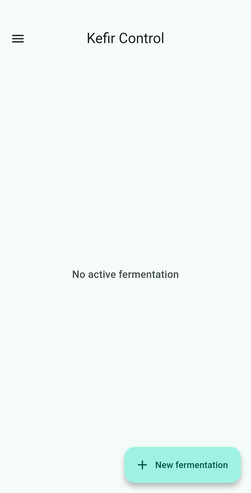
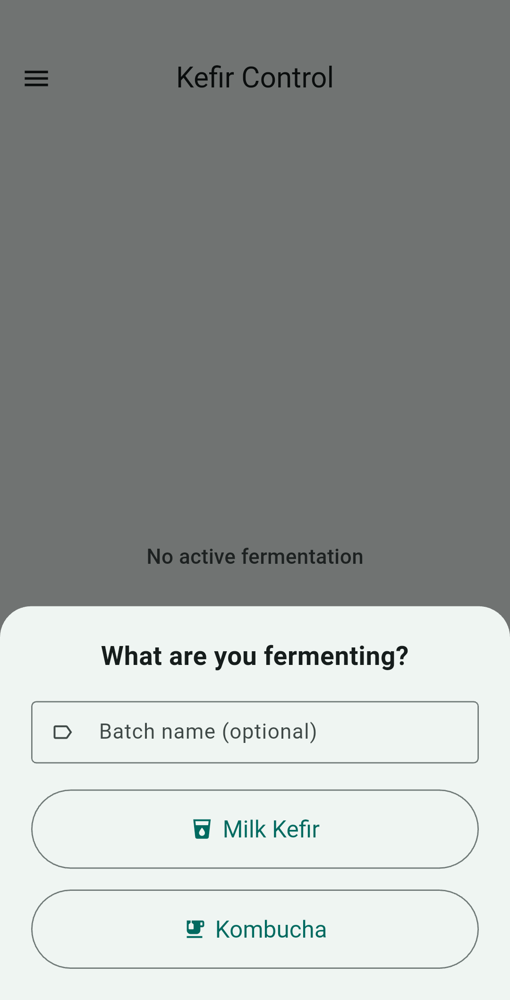
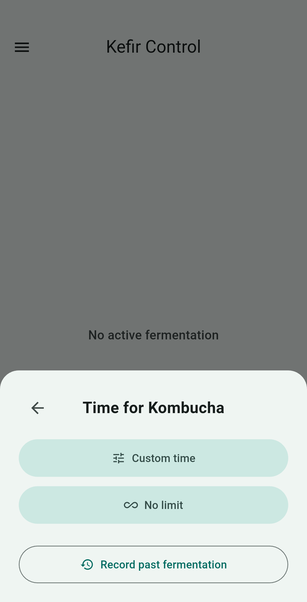
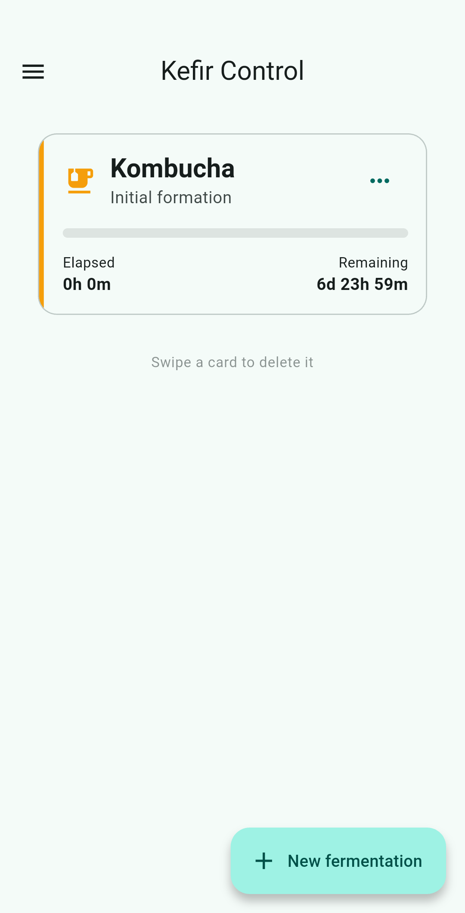

<h1 align="center">
  
  <br/>
  Kefir Control
</h1>

<p align="center">
  A minimalist, open-source, and tracker-free application to manage your milk kefir and kombucha fermentations, ensuring they never over-ferment again.
</p>

<p align="center">
  
  
  
</p>

<p align="center">
  <a href="https://f-droid.org/packages/eu.raulmorales.kefircontrol" target="_blank">
    
  </a>
</p>

<p align="center">
  <a href="readme_i18n/README_es.md">Spanish</a> |
  <a href="README.md">English</a> |
  <a href="readme_i18n/README_and.md">Andalusian</a>
</p>

<p align="center">
  
  
  
  
</p>

## 🥛 About the Project
**Kefir Control** was born from the need to remember when your fermentation is at its perfect point. Whether it's milk kefir or kombucha, this app simplifies the process with scheduled local notifications, a live timer, and learning based on your preferences.

The project is **100% Free and Open Source Software (FOSS)**, privacy-focused, and features a modern UI based on Material Design 3.

## ✨ Main Features
- **🥛 Kefir & Kombucha Management**: Specific support for different fermentation types with custom stages.
- **⏱️ Smart Ideal Times**: The app learns from your past harvests to suggest the fermentation time you like best.
- **🔔 Notifications & Pre-alerts**: Local alarms (no internet required) that notify you when finished and 2 hours before.
- **♾️ Open-ended Mode**: Start fermentations without a time limit for total manual control.
- **📅 Integrated Calendar**: View your history and plan future batches visually.
- **📱 Material You**: Dynamic color support and dark/light theme following Material Design 3.
- **📳 Haptic Feedback**: Physical interactions through vibration for a more immersive experience.
- **💾 Backups**: Export and import data in JSON format.
- **🌍 Multilingual**: Available in Spanish, English, and Andalusian (EPA).
- **🔒 Privacy First**: No accounts, no trackers, and no analytics. Your data is yours alone.

## 🛠️ Technologies and Requirements
- [Flutter SDK](https://flutter.dev/) (>= 3.0.0)
- Key packages used:
  - `shared_preferences` (Local persistence)
  - `flutter_local_notifications` (Native Notifications)
  - `flutter_timezone` (Timezone management)
  - `flex_color_scheme` (Advanced M3 Theming)

## 🚀 Installation and Build for Developers
To build the application yourself from source:

1. Clone this repository:
   ```bash
   git clone https://github.com/raulmoralesruiz/kefir-control.git
   ```
2. Enter the project folder:
   ```bash
   cd kefir-control
   ```
3. Download dependencies:
   ```bash
   flutter pub get
   ```
4. Run the app on your emulator or physical device:
   ```bash
   flutter run
   ```

## 📜 License
This project is licensed under the **GNU Affero General Public License v3.0 (AGPLv3)**.
You are free to use, modify, and distribute the software, but modifications and network versions of this software must be distributed under the same license. See the [LICENSE](../LICENSE) file for more information.
