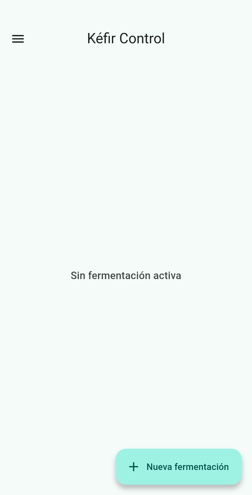
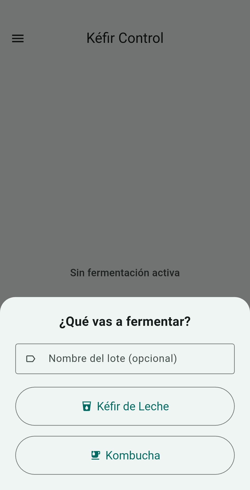
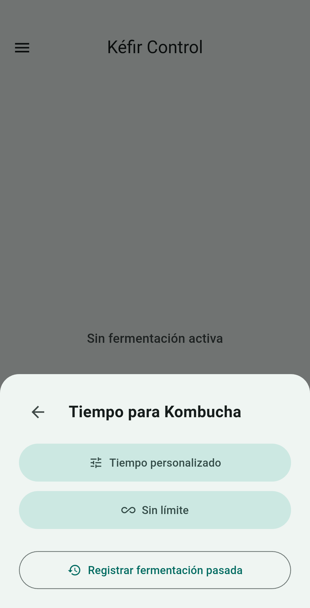
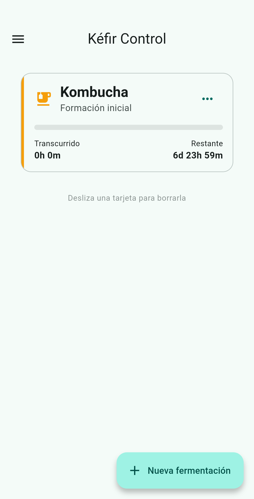
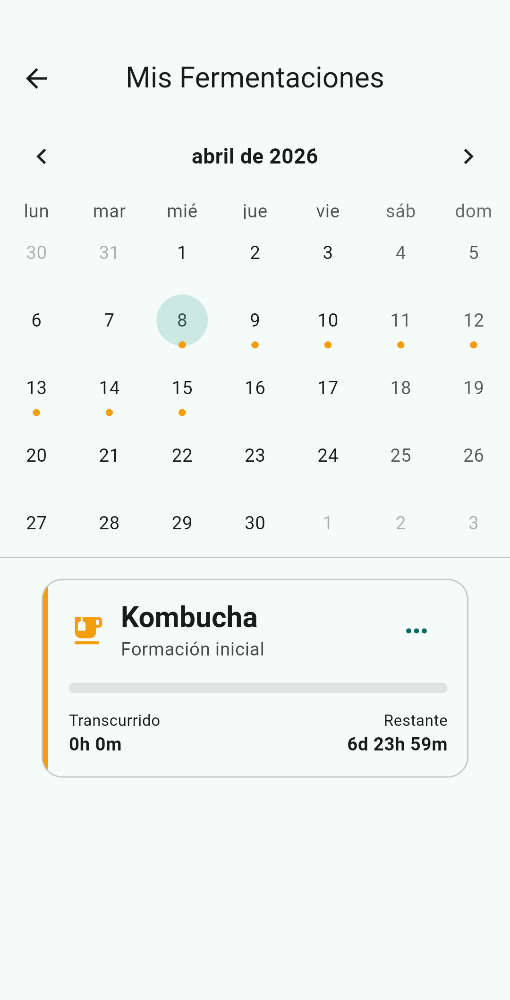

<h1 align="center">
  
  <br/>
  Kéfir Control
</h1>

<p align="center">
  Una aplicación minimalista, open-source y libre de rastreadores para gestionar tus fermentaciones de kéfir de leche y kombucha, asegurando que nunca más se pasen de tiempo.
</p>

<p align="center">
  
  
  
</p>

<p align="center">
  <a href="../readme_i18n/README_es.md">Castellano</a> |
  <a href="../README.md">English</a> |
  <a href="../readme_i18n/README_and.md">Andaluz</a>
</p>

<p align="center">
  
  
  
  
  
</p>

## 🥛 Sobre el Proyecto
**Kéfir Control** nació de la necesidad de recordar cuándo tu fermentación está en su punto perfecto. Ya sea kéfir de leche o kombucha, esta aplicación simplifica el proceso con notificaciones locales programadas, un temporizador en vivo y aprendizaje basado en tus gustos.

El proyecto es **100% Free and Open Source Software (FOSS)**, centrado en la privacidad y con una interfaz moderna basada en Material Design 3.

## ✨ Características Principales
- **🥛 Gestión de Kéfir y Kombucha**: Soporte específico para diferentes tipos de fermentación con etapas personalizadas.
- **⏱️ Tiempos Ideales Inteligentes**: La app aprende de tus cosechas pasadas para sugerirte el tiempo de fermentación que más te gusta.
- **🔔 Notificaciones y Pre-avisos**: Alarmas locales (sin internet) que te avisan al finalizar y 2 horas antes.
- **♾️ Modo Libre**: Inicia fermentaciones sin límite de tiempo para un control totalmente manual.
- **📅 Calendario Integrado**: Visualiza tu historial y planifica futuras tandas de forma visual.
- **📱 Material You**: Soporte para colores dinámicos y tema oscuro/claro fiel a Material Design 3.
- **📳 Feedback Háptico**: Interacciones físicas mediante vibración para una experiencia más inmersiva.
- **💾 Copias de Seguridad**: Exportación e importación de datos en formato JSON.
- **🌍 Multilingüe**: Disponible en Castellano, Inglés y L'Andalú (EPA).
- **🔒 Privacidad Primero**: Sin cuentas, sin trackers y sin analytics. Tus datos son solo tuyos.

## 🛠️ Tecnologías y Requisitos
- [Flutter SDK](https://flutter.dev/) (>= 3.0.0)
- Paquetes clave utilizados:
  - `shared_preferences` (Persistencia local)
  - `flutter_local_notifications` (Notificadores Nativos)
  - `flutter_timezone` (Gestión de alarmas en la zona horaria del sistema)

## 🚀 Instalación y Compilación para Desarrolladores
Si deseas compilar la aplicación tú mismo desde el código fuente:

1. Clona este repositorio:
   ```bash
   git clone https://github.com/raulmoralesruiz/kefir-control.git
   ```
2. Accede a la carpeta del proyecto:
   ```bash
   cd kefir-control
   ```
3. Descarga las dependencias:
   ```bash
   flutter pub get
   ```
4. Ejecuta la aplicación en tu emulador o dispositivo físico:
   ```bash
   flutter run
   ```

## 📜 Licencia
Este proyecto está licenciado bajo la **GNU Affero General Public License v3.0 (AGPLv3)**.
Eres libre de usar, modificar y distribuir el software, pero las modificaciones y versiones de red de este software deben ser distribuidas bajo la misma licencia. Consulta el archivo [LICENSE](LICENSE) para más información.
